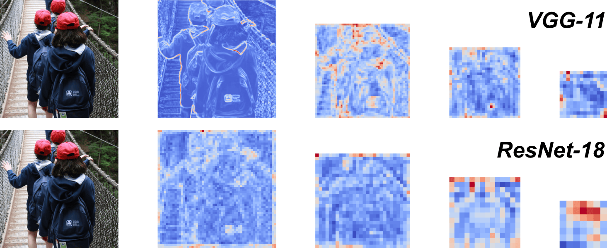

To quote myself in a most recently yet-to-be-published paper:

> 💪 The ability of deep neural networks (DNNs) come from extracting and interpreting features from the data provided.

<!-- more -->

What we call, *deep features*, are the abstract, latent, and complex representations that are naturally derived from the training data fed into the DNN. They reflect a consistent activation or response of a layer/node within the model hierarchy to an input.

<figure markdown>
  
  <figcaption>The features from within a pretrained VGG-11 (top) and ResNet-18 (bottom) on layers of different depths visualized.</figcaption>
</figure>

Generic and semantic deep representations that DNNs learn through training on even simple image-level labels (supervised learning for classification), **allow them to build both global understandings and localizable features of images** that empower downstream tasks including object detection, similarity measurement, among others.

Using *__hooks__*, we will be able to extract these internal data from within DNNs, **with the benefit of NOT having to tamper with model source code or even deconstructing the model itself.** They are one of the best ways for us to probe into model interals without having to tear the model apart.

## The Basics

PyTorch models are constructed through layer-stacking.

Take the infamous VGG-11 model for example:

```python
>>> from torchvision.models import vgg11
>>> model = vgg11()
>>> print(model)
```


```
VGG(
  (features): Sequential(
    (0): Conv2d(3, 64, kernel_size=(3, 3), stride=(1, 1), padding=(1, 1))
    (1): ReLU(inplace=True)
    (2): MaxPool2d(kernel_size=2, stride=2, padding=0, dilation=1, ceil_mode=False)
    ...
    (18): Conv2d(512, 512, kernel_size=(3, 3), stride=(1, 1), padding=(1, 1))
    (19): ReLU(inplace=True)
    (20): MaxPool2d(kernel_size=2, stride=2, padding=0, dilation=1, ceil_mode=False)
  )
  (avgpool): AdaptiveAvgPool2d(output_size=(7, 7))
  (classifier): Sequential(
    (0): Linear(in_features=25088, out_features=4096, bias=True)
    ...
    (4): ReLU(inplace=True)
    (5): Dropout(p=0.5, inplace=False)
    (6): Linear(in_features=4096, out_features=1000, bias=True)
  )
)
```

On the outmost layer, the model is composed of three modules: `features`, `avgpool`, and `classifier`. Inside of which, are layers, including `Conv2d`, `ReLU`, and `MaxPool2d`, etc., stacked sequentially.

When an image of shape $[1, 3, 224, 224]$ is fed into the VGG-11 model:

- Layer `features` is the convolutional backbone, extracting features from the image.
- After feature extraction, layer `avgpool` averages the features spatially.
- Finally, layer `classifier` classifies the image into one of the 1000 classes.

## Extracting Features

The features extracted by the `features` module in VGG-11 is often what we are most interested in.

Different models exhibit different feature extraction strategies.

These include features
