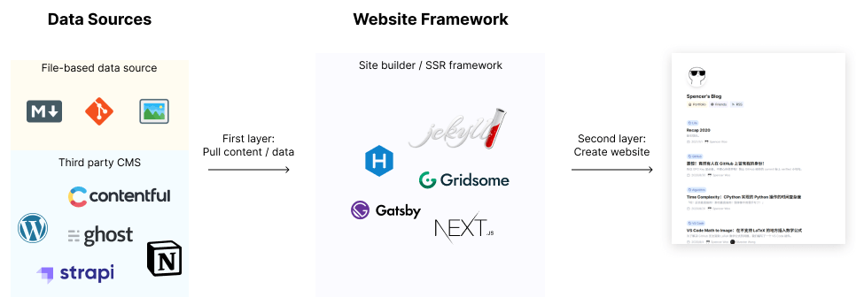
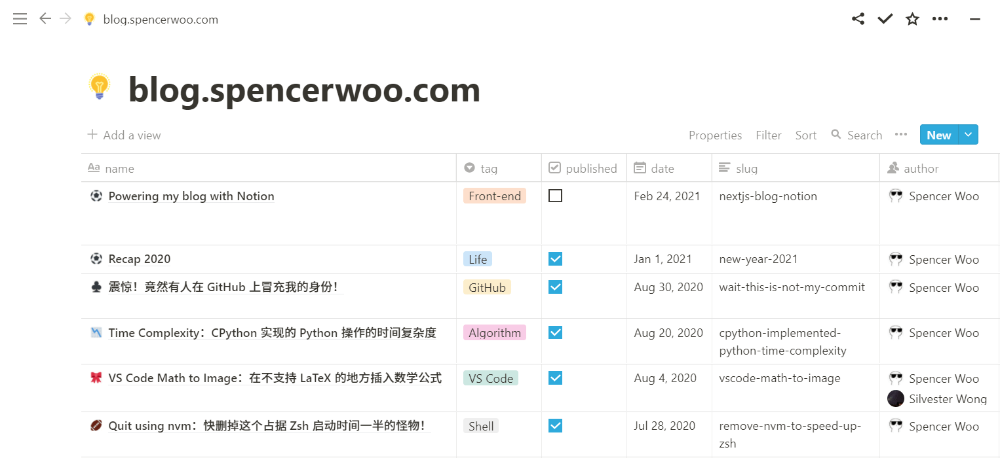
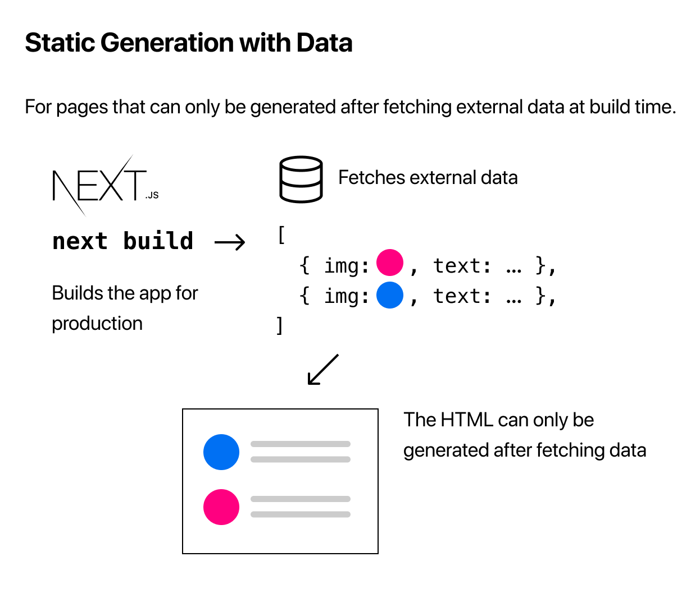

!!! bug "🔥"
    An update in 2022: **[Revisiting blogging with Notion in 2022](./revisiting-blogging-with-notion-2022.md).**


Yup, yup, yup! (Paimon noises 🥁) **My blog, that you are currently reading, is now officially powered by the one and only — Notion!** Not only is my site still _clean, uncluttered, and performative_, but I can now get rid of all the annoying stuff where I have to manually write and push Markdown in VS Code, upload my images to a CDN through some poorly managed script, and rebuild my blog each time I publish new content. Notion has that sweet sweet rich-content management experience, why not use Notion as my blog's CMS?

<!-- more -->

## Some background

Notion-as-CMS is not exactly a new idea in any sort of way. Although Notion hasn't officially announced their API yet, a great many people have been successful in reverse engineering their private API, which I believe some low-code / no-code startups (like Super.so) is highly dependent on. Splitbee was one of the first to actually use Notion for their blog (link here: [Splitbee Blog](https://splitbee.io/blog)), and they implemented a whole ecosystem of API proxies and React components around this idea of pulling and rendering content from Notion.

[splitbee/react-notion](https://github.com/splitbee/react-notion)

In addition, NotionX built upon what Splitbee has done and extended the rendering functionalities of `react-notion` and implemented a CORS-friendly Node.js and Deno compatible `notion-client` (that doesn't depend on CloudFlare Workers anymore), which is the package `react-notion-x`.

[NotionX/react-notion-x](https://github.com/NotionX/react-notion-x)

While these two packages are quite similar, they actually both represent **a different approach** in rendering content pulled from Notion. For the remainder of this article, I'll be addressing some of the technical details of both these packages, the reason that I chose one package over the other, and how I added some more spice to what my blog is now currently constructed with.

BTW, this is my current blog template open source on GitHub if you are interested in checking out.

[spencerwooo/react-notion-blog](https://github.com/spencerwooo/react-notion-blog)

## How are blogs built and rendered?

There's a ton of [Jamstack](https://jamstack.org/) blog engines like [Gatsby](https://www.gatsbyjs.com/) and [Gridsome](https://gridsome.org/) that are able to pull content off from a CMS and statically render your data into beautiful websites. There are two layers of meanings in this phrase: ① pull content from a CMS, and ② render the website statically.

The first layer, pulling content, defines where and how our blog's data is coming from. Conventional blog engines hosted on GitHub (Hexo, Hugo, Jekyll) host their "content" in files stored and managed by Git. Gatsby and Gridsome, besides supporting file-based content sourcing, also have plugins that enables them to pull "content" from a third-party CMS, whether it's a self-hosted WordPress or Ghost, or a standalone cloud-based solution like Strapi, DatoCMS, or Contentful.

The second layer, rendering the content, is handled by our website generator, where it makes use of the data that we provide in the first layer, and compiles / renders the website on demand. Again, conventional blog engines (Hexo, Hugo, Jekyll) get their data during build-time, and requires rebuilding the entire site when data is updated (like updating articles, publishing new articles, etc.). Newer frameworks (like Next.js) are able to take advantage of "server-side rendering" (SSR) that guarantees to return the newest content pulled from layer one without having to rebuild or re-render the whole site.



How content from data source is pulled and generated into websites like our blogs

In our case, Notion is our "CMS" and is where we are pulling content from in the first layer. I am using the Next.js framework in the second layer for statically and incrementally generating my actual blog website.

## How are we rendering our blog?

In the previous sections, I mentioned that there exists two similar libraries that we can leverage for rendering our website with data pulled from Notion: `react-notion` and `react-notion-x`. These two packages are alike in that they both render pages (React components) with a `BlockMap` type of data structure returned from the private Notion API (instead of our usual Markdown content).

A slight difference is that the former `react-notion` builds upon the `notion-api-worker` (which is a serverless function deployed on CloudFlare Workers) to return either a JSON response of a Notion's database, or a `BlockMap` representing the Notion page.

[splitbee/notion-api-worker](https://github.com/splitbee/notion-api-worker)

The latter `react-notion-x` uses `notion-client` to do get the job done, and focuses on rendering the entire page "Notion-style" (with Notion breadcrumbs, Emoji, header image, etc.).

[NotionX/react-notion-x](https://github.com/NotionX/react-notion-x/tree/master/packages/notion-client)

Either way, these two packages makes it extremely trivial to both get content from Notion and rendering pages based on that content. I ended up building my blog with `react-notion` with data pulled from a Notion "table" database collection.



The database collection used to store all my blog posts

This database acts as a data source and content provide for my website framework to fetch and render into an actual website. Some of the JSON data pulled from it looks like:

```json
[
  {
    id: "64a68296-4e79-4036-b41d-7139c2c5887e",
    tag: "Front-end",
    slug: "nextjs-blog-notion",
    author: [...],
    date: "2021-02-24",
    preview: "Using Next.js to build a full-blown server-side rendered and statically generated blog pulling content from Notion.",
    name: "Powering my blog with Notion"
  },
  ...
]
```

Pretty standard stuff right? With this data we can easily build a website that renders this list of blog posts and the inner content of each article.

!!! note
    🤖 I failed with using `notion-client` to get a returned list of my database collection. So I ended up pulling the data from Notion's database with Splitbee's API worker, and using `react-notion-x` solely for rendering the article.

!!! note
    🔥 The "x" version has a lot of extra Block rendering support including equations, embedded PDFs, external third party blocks , etc. So be sure to use that one if you are not using a database but a single page instead as the entry point of your blog.

## Why Next.js?

Usually SPA (Single Page Applications) built with React or Vue are "Client-side Rendered", which means they fetch extra data from the server after the browser loads the HTML page of the website. However, if we load our long list of blog post and their actual content asynchronously, our visitors won't have a nice experience where they'll have to wait when the page is loaded but the content is not (especially when Notion's API is slower than ever).

"Server-side Rendering" (SSR) and "Static Site Generation" (SSG) are what we are looking for here.

- **Server-side Rendering** means that the data from Notion is fetched from the server (at build-time), the server returns the page + content rendered altogether to the browser instead of having the browser to fetch extra data and render afterwards.
- **Static Site Generation** is a crucial part of Jamstack for making it so fast and performative, and is still what the conventional tools do (Hexo, Hugo, etc.). However, these conventional tools create sites that are _really_ static — what comes out from build-time remains the same. Any content or data change requires rebuilding the whole site.

What really makes Next.js standout is that this framework supports all of these features right out of the box! I initially tried to use Vite as he's the hot kid in town, but turns out `vite-ssr` requires serious configurations and also doesn't support TypeScript as of now. Next.js really pairs well with Vercel, which is my front-end deployment platform of choice.

For our blog then, we can actually leverage "SSG with data", which fetches data at build time and compiles our website statically. (The specific function is called `getStaticProps`.)



Static site generation with external data (Next.js)

> But hey! How is that different from conventional static site generators? They also fetch external data (query the file system for Markdown files) and generate HTML at build time. What makes Next.js better?

Yes, that is absolutely true, SSG often have to rebuild the site when data from the source is updated. However, with Next.js, we have another mighty weapon at disposal — _[Incremental Static Regeneration](https://nextjs.org/docs/basic-features/data-fetching#incremental-static-regeneration)!_ Our good friend Vercel, with its powerful serverless capabilities, is able to query our source for new data, and incrementally regenerate new content at a given frequency. In our case, Vercel will revalidate our list of blog posts and its contents once per second. All we need to do is return a `revalidate: 1` property in our `getStaticProps` function.

```ts
return {
  props: {
    posts,
    ...
  },
  // Next.js will attempt to re-generate the page:
  // - When a request comes in
  // - At most once every second
  revalidate: 1, // In seconds
}
```

!!! tip
    🔥 If you add a new blog post, or update one, **it will be available almost immediately,** without having to re-build your app or make a new deployment.

## Missing stuff

### Pagination

One of the first things that's missing is pagination that let's you navigate between blog posts.


Pagination

The way I implemented it is simply returning an additional property inside `getStaticProps`, namely `pagination`, which identifies the previous and next post for the current post:

```ts
const pagination: Pagination = {
  prev: postIndex - 1 >= 0 ? posts[postIndex - 1] : null,
  next: postIndex + 1 < posts.length ? posts[postIndex + 1] : null,
}
```

Details here: [spencerwooo/react-notion-blog](https://github.com/spencerwooo/react-notion-blog/blob/main/pages/%5Byear%5D/%5Bmonth%5D/%5Bslug%5D.tsx#L18-L41).

### Comments

Embedding an additional Disqus comment block is easy, the hard part was to migrate all of my comments from my previous blog (which was rendered by Gridsome BTW). Luckily I had a specific `slug` field in my Notion database which allows me to control the actual page URL of each one of my specific blog posts.

```html
<DiscussionEmbed shortname="spencerwoo" config={{ identifier: formatSlug(post.date, post.slug) }} />
```

This way, all of my articles shared identical URL paths with my old blog. Disqus can then take the comments on my old articles and render them here in my new blog under the same articles.

### RSS

This is one of the tricky parts. Because Next.js has a file-based routing system, if we wanted to add a specific `/feed` or `/feed.xml` path to our blog, the easiest way is to create another file named `feed.tsx` or `feed.xml.tsx` under `/pages` (Next.js dedicated directory for rendering routes), and return our RSS XML file when visitors access this page.

However, Next.js doesn't have a dedicated method where it let's you return a raw HTML (or XML feed file in our case) instead of a React component. This means that we have to return a `React.FC` type component for React to render as HTML if we were to create this page. I did a bit of searching and found most solutions on the internet for Next.js RSS feeds are to manually generate this `feed.xml` file at build time and then manually moving this file to `/public` where Next.js will happily serve this file.

> But won't this mean our up-to-date content will not be reflected on our RSS?

Exactly! If we are doing this, then it means we aren't taking advantage of SSR and will have to rebuild our RSS feed each blog update. Not nice!

Instead, I discovered another API from Next.js that allows you to manually set the `Content-Type` of a response if we visit a page in a function called `getServerSideProps`. This function exposes a `context` property with the following fields:

- `req`: The HTTP IncomingMessage object.
- `res`: The HTTP response object.
- ...

Yup, yup, yup! That `res` is exactly what we are looking for. Using this, we can manually set our response content type to be XML, and also writing our actual feed XML as response. We can also return an empty React component to bypass Next.js's limitations. Our final feed.tsx basically looks like this:

```ts
const Feed: FC = () => null

export const getServerSideProps: GetServerSideProps = async ({ res }) => {
  if (res) {
    const posts = await getAllPosts()
    const xmlFeed = generateRss(posts)

    res.setHeader('Content-Type', 'text/xml')
    res.write(xmlFeed)
    res.end()
  }

  return {
    props: {},
  }
}

export default Feed
```

Neat! Now we can have up-to-date RSS feeds without rebuilding the entire site over and over again. In addition, I used the [feed](https://www.npmjs.com/package/feed) package to construct my RSS feed. Details here: [spencerwooo/react-notion-blog](https://github.com/spencerwooo/react-notion-blog/blob/main/pages/feed.tsx).

This concludes the 2000+ word loooong article covering the technical details of my Notion powered, Next.js built, both statically rendered and incrementally updated website. Hope you enjoyed this, cheers! 🍻
