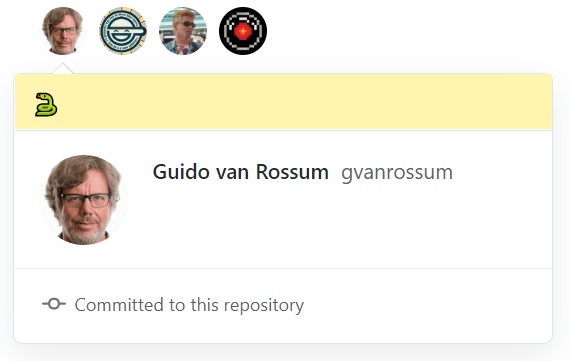
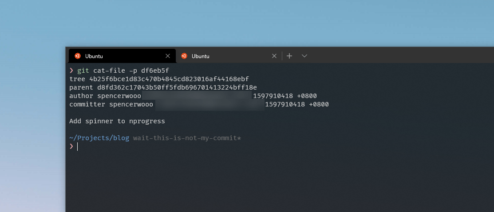
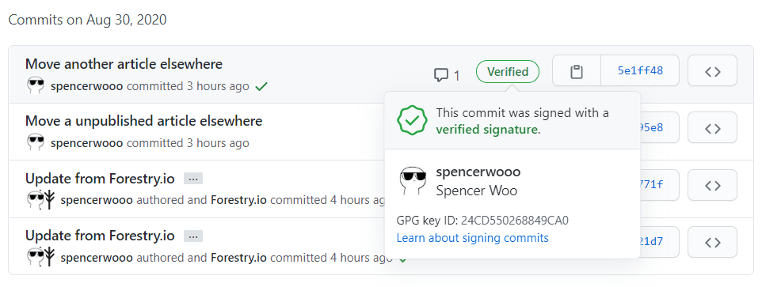
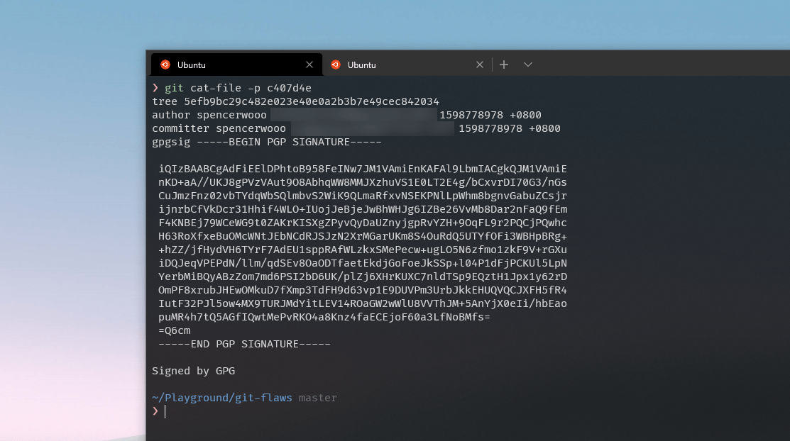

## **起因**

这件事情还要从我校为毕业生收拾行李开始讲起。今年六月末北京疫情复发，这一波直接让我们北京高校毕业生无法返校，个人行李物品必须由学校老师代为整理快递回家。这件事情让同级的同学们非常不满，于是微博知乎节奏飞起。当然这件事情是北京统一的行为，其中不光有我校学生自己不满，其他北京的学校听说有些处理的比我校更要糟糕，所以这件事情我们暂且不做评价。但从事情开始，就有「好事」的同学除了在知乎等平台上进行回答评论、表达意见，还直接在 GitHub 上面直接整理记录时间线。

<!-- more -->


一个目录，暂时不放具体仓库与地址

## **我被牵扯进去了？**

为什么这个仓库引起了我的注意呢？首先，对于收拾行李这件事情来说，我所在学院做的其实不错，我自己是我院一位备受尊敬的副教授老师为我收拾的，整理的非常好，所以我个人自始至终并没有对这件事情有什么太大意见，没有参与知乎讨论，也没有进行所谓的争论抗议。这些都是两个月之前发生的事情，但是，两个月之后的今天，有认识我的同学告诉我这个仓库的存在，**并私下询问我为什么也给这个仓库进行了贡献。**

**是的，一个我直到昨天都还完全不知道存在的仓库，有人看到了「一条 commit 是由我的邮箱签入的」，并「链接到我的 GitHub 账户」。**

我当时：


好奇心让我点开了同学发给我的链接，向下划到 Contributors，果然，我的头像就在那里。


淦，老子昨天才知道你这仓库的，宁真厉害

好嘛，除了我的头像，还有个我非常眼熟的头像 —— 下面这位老爷子：



这人我看着有点眼熟……

我去，这不是 Python 他爹吗？！！敢情 Python 之父也关心我们小破学校毕业生收拾行李的事情了？

## **我惊了**

仔细看了一下贡献者列表，其中不乏开源世界的知名人物，也包括一些我校在 GitHub 上有账号的同学们。好了，这处处透露着诡异的仓库，**看起来除了这位仓库主人自己的 commit 以外，其余所有的 commit 的身份信息都是伪造的。**

<figure markdown>
  
  <figcaption>细节修改你个大头鬼啊，这里「我的」commit 周围都被篡改为我身边认识的大佬同学了</figcaption>
</figure>

这件事情昨天确实让我非常震惊：Git 的 commit 记录竟然还可以伪造。我确实之前从来没有在意过这类安全问题，以为签入 Git 记录的内容都有完善的身份验证，**而事实证明我太天真了。**

这位我完全不认识的同学，我不知道你是何种初衷，把这个「搞事情」的仓库的 commit 记录在我们都不知情的情况下篡改为我们的身份，**但是你这种行为让我感到非常恶心**。如果你自己都不敢于承担自己「搞事情」所带来的风险，一定要「强行」拉着一群不知情的同学，来装作好多人都对此有所看法、跃跃欲试、一起贡献的样子，**那你还搞个 🐔 8️⃣ 啊！**

那…现在怎么办？我自己给 GitHub Support 已经发去了邮件，不知道这种事情 GitHub 会不会帮我解决，但是从我自己的角度来说，除了尽可能通知我认识的同学他们在 GitHub 上也被人冒充了外，也只能分析一下为什么这种漏洞会存在，以及接下来该如何解决这种问题了。

## **漏洞分析**

### **Git 的设计缺陷**

事实上，Git 本身是具有这样的设计缺陷的。**Git commit 信息的 author 是一个可以零成本造假的字符串。**首先，我们来看看一个 commit 里面包含哪些信息。我们可以用  `git log`（或 Oh My Zsh 的 alias 命令：`glog`  来打印一个更为清楚的 commit 历史）来查看本地 Git 仓库的 commit 记录，并找到一个特定 commit 的 hash，比如我当前仓库的 HEAD commit hash 为  `d3f97ef`。

<figure markdown>
  
  <figcaption>Git 仓库的 commit 记录</figcaption>
</figure>

我使用一个上周的 commit hash `df6eb5f`，我们可以用  `git cat-file -p df6eb5f`  来查看这一 commit 的具体信息：

<figure markdown>
  
  <figcaption>Commit hash 为 df6eb5f 的 commit 具体信息</figcaption>
</figure>

可以发现，每个 commit 都拥有 commit 的 author 和 commit 的 committer，分别是 commit 的第一作者和执行 commit 具体操作的人。如何确认这两人的具体身份呢？Git 仅记录了 commit author 和 committer 二人的名称、邮箱和时间戳，而其中的名称和邮箱正是我们配置 Git 时设定的  `user.name`  和  `user.email`，而 GitHub 也正是通过这两个内容确定 commit 的具体作者和 GitHub 身份的。

好的，既然我们知道了 Git 和 GitHub 是如何确认身份的，那么我们如何修改 commit author 和 committer 呢？事实上，这两个内容仅是字符串存储的，`user.name`  和  `user.email`  都是可以任意篡改的，因此我们完全可以直接修改自己 git config 中存储的  `user.name`  和  `user.email`  来让本次 commit 的作者变为另一个人。原生 Git 完全没有任何第二层防护！

甚至，我们可以将整个仓库的 Git commit 历史通过  `filer-branch`  批量修改为其他的人：

```shell
git commit -am "Destroy production"
git filter-branch --env-filter \
  'if [ "$GIT_AUTHOR_EMAIL" = "iamthe@evilguy.com" ]; then
     GIT_AUTHOR_EMAIL="unsuspecting@victim.com";
     GIT_AUTHOR_NAME="Unsuspecting Victim";
     GIT_COMMITTER_EMAIL=$GIT_AUTHOR_EMAIL;
     GIT_COMMITTER_NAME="$GIT_AUTHOR_NAME"; fi' -- --all
git push -f
```

大概就是这样，Git 的 commit 是可以任意修改的，你可以将某个坏 commit 嫁祸给别人，甚至将某个坏仓库的 commit 批量嫁祸给毫不知情的人，但我希望大家永远都不要做这样的事情！

### **如何防范这种行为？**

这可怎么办，我们该如何在互联网上证明自己是自己？该如何证明这不是自己？对于 Git 来说，其实我们还是有办法的 —— GPG 签名。GPG 全称为 GNU Privacy Guard，GPG 通过非对称加密来帮助我们从密码学的角度证明「我是我」，也从而证明「这不一定真的是我」。

使用一个只有我们自己手中拥有的 GPG 私钥对我们的 commit 进行签名，可以让 GitHub 确认我们本次 commit 是真实且是本人操作的。这样，别有用心的他人就无法以我们的身份创建「被签名」的 commit。在 GitHub 上使用的 GPG 密钥和我们的 SSH 密钥并不一样，后者 SSH key 唯一存在的原因是为了向 GitHub 证明身份，用于向我们拥有权限的仓库中进行 commit，而前者 GPG key 则是为了「证明我拥有本次 commit 的著作权」，也只有用 GPG 私钥签名的 commit 在 GitHub 上才会显示如下图的 Verified 绿色钦定小标标。

<figure markdown>
  
  <figcaption>使用 GPG 签名的 commit 会在 GitHub 上显示 Verified 标志</figcaption>
</figure>

## **使用 GPG key 来证明 commit 著作权**

!!! note
    💙 GitHub 官方文档拥有更为详细的 GPG 密钥构建和添加方法：[Managing commit signature verification](https://docs.github.com/en/github/authenticating-to-github/managing-commit-signature-verification).

### **下载安装 GPG**

首先，我们需要下载安装 GPG 命令行工具，在 Windows 上可以通过  `scoop install gpg`  来安装，大部分 Linux 发行版也应该直接拥有 GPG 工具。

```shell
# Windows 用户下载安装 GPG
$ scoop install gpg
```

使用  `gpg --version`  查看 GPG 安装情况和版本信息，并记住 GPG 存储根目录：即输出内容中的 Home 目录。

```shell
# 测试 GPG（Windows 或 Linux）
$ gpg --version

gpg (GnuPG) 2.2.19
libgcrypt 1.8.5
Copyright (C) 2019 Free Software Foundation, Inc.
License GPLv3+: GNU GPL version 3 or later <https://gnu.org/licenses/gpl.html>
This is free software: you are free to change and redistribute it.
There is NO WARRANTY, to the extent permitted by law.

Home: /home/spencer/.gnupg
Supported algorithms:
Pubkey: RSA, ELG, DSA, ECDH, ECDSA, EDDSA
Cipher: IDEA, 3DES, CAST5, BLOWFISH, AES, AES192, AES256, TWOFISH,
        CAMELLIA128, CAMELLIA192, CAMELLIA256
Hash: SHA1, RIPEMD160, SHA256, SHA384, SHA512, SHA224
Compression: Uncompressed, ZIP, ZLIB, BZIP2
```

### **为自己生成一对 GPG 密钥**

之后，我们就可以用下面的命令来为自己生成一个 GPG 公钥和私钥：

```shell
$ gpg --full-generate-key
```

- 在密钥种类处：选择默认 RSA and DSA 即可；
- 在密钥长度选项处：按照 GitHub 的要求选择 4096 bits；
- 在密钥过期时间处：按照自己的需要选择，默认为永不过期；
- 在我们的用户 ID 和 GPG key 签名邮箱处：填写我们的常用用户名，并**填入 GitHub 上面认证过的邮箱**；
- 最后，为密钥设置一个安全的密码，并一定记住这一密码。

这样，我们就生成了我们的第一对 GPG 密钥！我们可以用这样的命令查看当前我们拥有的所有 GPG key：

```shell
$ gpg --list-secret-keys --keyid-format LONG

/home/spencer/.gnupg/pubring.kbx
--------------------------------
sec   rsa4096/24CD550268849CA0 2020-08-29 [SC]
      9433E1B6807DE7C15E20DC3B24CD550268849CA0
uid                 [ultimate] Spencer Woo (My GPG key) <my@email.com>
ssb   rsa4096/EB754D2B2409E9FE 2020-08-29 [E]
```

其中，`sec`  一行的  `rsa4096/24CD550268849CA0`  就是我们的 GPG 私钥，其中的  `24CD550268849CA0`  即为我们的 GPG 私钥 ID。

### **告诉 Git 自己的 GPG 密钥 ID**

生成了 GPG 密钥，并拿到了我们的 GPG 私钥 ID 后，我们即可让 Git 用这一 GPG key 为我们的 commit 进行签名：

```shell
$ git config --global user.signingkey 24CD550268849CA0
$ git config --global commit.gpgsign true
```

这样设置后，如果没有问题，之后的 commit 中 Git 就会自动为我们用这一 GPG 私钥进行签名。我们可以用这一命令确认签名的存在：

```shell
$ git log --show-signature

commit c407d4efc980cbee981da50d714a751999b19ddf (HEAD -> master)
gpg: Signature made Sun Aug 30 17:16:18 2020 CST
gpg:                using RSA key 9433E1B6807DE7C15E20DC3B24CD550268849CA0
gpg: Good signature from "Spencer Woo (My GPG key) <my@email.com>" [ultimate]
Author: spencerwooo <my@email.com>
Date:   Sun Aug 30 17:16:18 2020 +0800

    Signed by GPG
```

另外，此时我们再次用之前查看 commit 详细信息的命令查看本次 commit，我们会发现 GPG 签名已经直接保存于这一 commit 之中了：

```shell
$ git cat-file -p c407d4e
```

<figure markdown>
  
  <figcaption>已经签名过的 commit 包含有我们使用的 PGP signature</figcaption>
</figure>

另外，这里如果出现类似的问题，可能是 Git 使用的 GPG 命令行工具跟我们生成密钥使用的不一致。我们可以首先用  `which gpg`  来找到我们所使用的 GPG 工具的具体地址，比如  `/usr/bin/gpg`，之后告诉 Git 使用这一 GPG binary 即可：

```
$ git config --global gpg.program /usr/bin/gpg
```

!!! tip
    🥦 Windows 上的同学，也可以使用 `which` 命令！只需要用 scoop 安装：`scoop install which`，即可方便的用类似 Linux 上的语法找到相应的可执行文件具体路径。

### **告诉 GitHub 自己的 GPG 公钥**

最后，我们需要告诉 GitHub 我们使用的 GPG 公钥。对于刚刚我们拿到的私钥 ID：`24CD550268849CA0`，我们使用下面的命令即可导出我们的 GPG 公钥：

```shell
$ gpg --armor --export 24CD550268849CA0
```

将输出粘贴进入 GitHub 的  [Settings » SSH and GPG keys » New GPG key](https://github.com/settings/keys)，并保存。之后，我们就可以开始在 GitHub 上享受 Verified 被钦定的感觉！

## **小结**

使用 GPG 不仅可以证明我们的每次 commit 的所有权，还可以用类似的密码学方法证明 GitHub 账号的所有权、域名的所有权、Twitter 账号的所有权等等。我们将我们的 GPG 公钥托管在某个 GPG 服务器上面，别人就可以利用这一公钥来验证某个被签名的内容是否确实是我们所操作。[Keybase.io](https://keybase.io/inv/784d1a88fa)  是一个 trusted database for public keys，推荐大家使用  [Keybase.io](https://keybase.io/inv/784d1a88fa)  托管自己的 GPG 公钥。

无论如何，大家都可以用这一命令拉取并导入我（Spencer Woo）的 GPG 公钥签名：

```shell
$ curl https://keybase.io/spencerwoo/pgp_keys.asc | gpg --import
```

- 我的 Keybase 地址：[keybase.io/spencerwoo](https://keybase.io/spencerwoo)
- 我的 Keybase 公钥：`ASCtXMcCY0UpKPF6NpoLlwJT3xXsD5nzunxF2ei4gBRBkgo`

感谢大家的阅读，希望大家都不会遭遇被冒充的情况！
